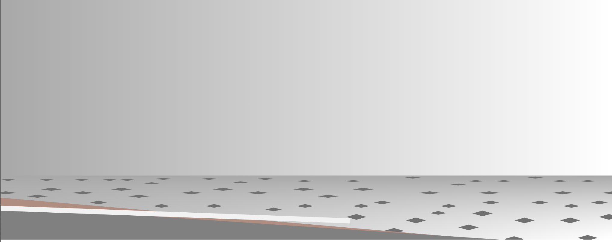

# beau-haus
portfolio site

## Feature-set

|<h3>Feature</h3>|<h3>Notes</h3>|<h3>Status</h3>|
|:-----------|:-------|:-------|
|**React**|16.0.0|***√***|
|**Responsivity**|2 breakpoints|*pending*|
|**Normalization**|normalize.css|***√***|
|**Layout**|CSS Grid|*pending*|
|**CSS Variables**|in :root{} of stylesheet|***√***|
|**Tooling**|Webpack|***√***|
|**babel-core**|env,react|***√***|
|**Animations**|CSS & SVG GSAP library|***√***|
|**Routes**|React-Router)|*pending*|
|**TabIndex Attrs**|a-tags and btns|*Pending*|

-----------------
 

### LoFi Landing Wireframe Desktop

### Wireframe Draft

### iPad Wireframe draft

##### Landing Page draft with wake, but no waves, yet.

### Waves Draft
- perspective needs adjusting.
- intention is to fade in and out each randomly.
- randomised timing, randomized duration

### Landing Page Draft II with white-caps. (decided to nix the dark waves & kept the white-caps in the distance)

- timing is now random for whitecaps.
- slight y-axis displacement to simulate incoming surf.
- BONUS: proper use of refs with GSAP!🎉 -woohoo!
