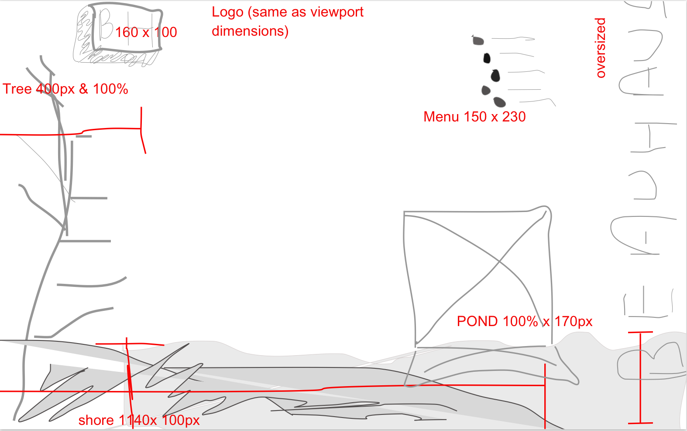

# beau-haus
portfolio site

## Feature-set

| <h3>Feature</h3>   | <h3>Notes</h3>           | <h3>Status</h3> |
| :----------------- | :----------------------- | :-------------- |
| **React**          | 16.0.0                   | ***√***         |
| **Responsivity**   | 2 breakpoints            | *pending*       |
| **Normalization**  | normalize.css            | ***√***         |
| **Layout**         | CSS Grid                 | *pending*       |
| **CSS Variables**  | in :root{} of stylesheet | ***√***         |
| **Tooling**        | Webpack                  | ***√***         |
| **babel-core**     | env,react                | ***√***         |
| **Animations**     | CSS & SVG GSAP library   | ***√***         |
| **Routes**         | React-Router)            | *pending*       |
| **TabIndex Attrs** | a-tags and btns          | *Pending*       |

-----------------

### LoFi Landing Wireframe Desktop

### Wireframe Draft

### iPad Wireframe draft

### Final Landing Page Desktop

## CSS boat "Please Hire Me" in morse code

https://en.wikipedia.org/wiki/Morse_code

